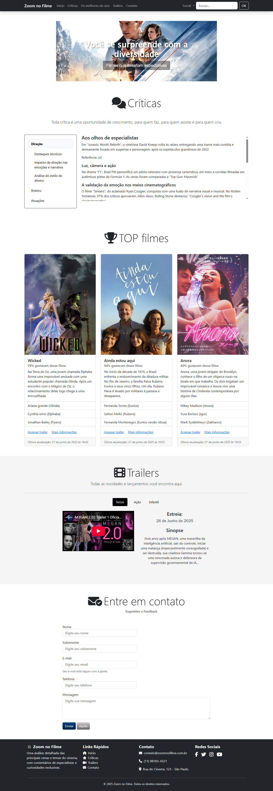

<<<<<<< HEAD
<div style="font-size: 30px; text-align: center;">
  🎬 Zoom no Filme
</div>

<p style="font-size: 16px;">
  Um blog de cinema responsivo e moderno, desenvolvido com foco em design e experiência do usuário, utilizando as últimas tecnologias de frontend.
</p>
=======
# 🎬 Zoom no Filme
Um blog de cinema responsivo e moderno, desenvolvido com foco em design e experiência do usuário, utilizando as últimas tecnologias de frontend.
>>>>>>> 309e53105e82fc1171bf862726789d73473be5f8



## 🚀 Visão Geral do Projeto

O "Zoom no Filme" é um blog dedicado a críticas, trailers e notícias do mundo cinematográfico. Ele oferece uma interface intuitiva e responsiva, garantindo que o conteúdo seja acessível e visualmente atraente em qualquer dispositivo. O projeto foi construído com Bootstrap 5, SASS e Font Awesome para um desenvolvimento eficiente e um design de alta qualidade.

## ✨ Funcionalidades Principais

- **Navegação Responsiva:** Menu de navegação que se adapta a diferentes tamanhos de tela.
- **Carrossel de Destaques:** Seção principal com carrossel de imagens e legendas para filmes em destaque.
- **Seção de Críticas:** Conteúdo detalhado sobre análises de filmes, com navegação lateral (scrollspy).
- **Cards de Filmes TOP:** Exibição de filmes em formato de card, com informações essenciais e links para trailers e mais detalhes (modais).
- **Seção de Trailers por Gênero:** Abas para explorar trailers de filmes organizados por gênero (Terror, Ação, Infantil).
- **Formulário de Contato:** Seção para os usuários enviarem sugestões e feedback.
- **Rodapé Completo:** Informações de contato, links rápidos e redes sociais.

## 🛠️ Tecnologias Utilizadas

Este projeto foi desenvolvido utilizando as seguintes tecnologias:

- **HTML5:** Estrutura básica da página.
- **CSS3:** Estilização geral do projeto, incluindo os estilos gerados pelo SASS.
- **Bootstrap 5:** Framework CSS para um design responsivo e componentes pré-estilizados. (Observação: O projeto foi inicialmente baseado em Bootstrap 4, mas foi atualizado para a versão 5 seguindo a documentação oficial para aproveitar os recursos mais recentes).
- **SASS (SCSS):** Pré-processador CSS utilizado para organizar e otimizar o desenvolvimento dos estilos personalizados do projeto. Os arquivos `.scss` são compilados para `.css`.
- **Font Awesome 6:** Biblioteca de ícones para adicionar elementos visuais (como os ícones de redes sociais, telefone, e-mail, etc.).
- **JavaScript (Bootstrap JS):** Para funcionalidades interativas como o carrossel, navegação, modais e popovers.

## 📦 Como Rodar o Projeto Localmente

Siga estas instruções para configurar e executar o projeto em sua máquina local:

### Pré-requisitos

Certifique-se de ter o Node.js e o npm (ou Yarn) instalados em seu computador, pois o Bootstrap e o SASS geralmente são gerenciados via npm.

- [Node.js e npm](https://nodejs.org/)

### Instalação

1.  **Clone o repositório:**

    ```bash
    git clone [URL_DO_SEU_REPOSITORIO]
    cd zoom-no-filme # ou o nome da sua pasta de projeto
    ```

    (Se você não estiver usando Git, pode baixar o ZIP do projeto e descompactá-lo).

2.  **Instale as dependências (Bootstrap, etc.):**

    ```bash
    npm install
    ```

    Este comando instalará as dependências listadas no `package.json`, incluindo o Bootstrap.

3.  **Compilar SASS:**
    Se você configurou um script para compilar SASS no seu `package.json` (por exemplo, usando `node-sass` ou `sass`), execute-o. Se não, você precisará compilar manualmente ou configurar um script.
    Exemplo de script no `package.json` (se tiver):

    ```json
    "scripts": {
      "sass:compile": "sass style/scss/style.scss style/css/style.css --watch"
    }
    ```

    Para executar o script de compilação:

    ```bash
    npm run sass:compile
    ```

    Isso observará as mudanças no seu arquivo `.scss` e as compilará para `.css`.

### Executando

1.  Abra o arquivo `index.html` em seu navegador web preferido. Não é necessário um servidor web para este projeto simples, pois ele consiste em arquivos estáticos. Basta clicar duas vezes no `index.html` ou arrastá-lo para a janela do navegador.

## 📂 Estrutura de Pastas

```
.
├── imgs/                    # Imagens do projeto (carrossel, cards, etc.)
├── node_modules/            # Dependências instaladas via npm (Bootstrap, etc.)
├── style/
│   ├── css/                 # Arquivos CSS compilados (incluindo style.css)
│   │   └── style.css
│   │   └── style.css.map
│   └── scss/                # Arquivos SASS/SCSS
│       └── style.scss
├── index.html               # O arquivo HTML principal do projeto
├── package.json             # Lista as dependências do projeto e scripts npm
├── package-lock.json        # Gerado pelo npm, registra as versões exatas das dependências
└── README.md                # Este arquivo
```

## 📄 Licença

Este projeto está licenciado sob a licença MIT. Sinta-se à vontade para usá-lo e modificá-lo.

---
